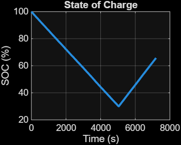
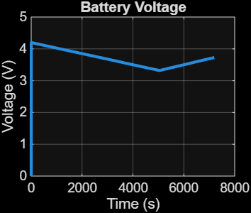
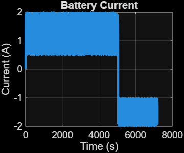
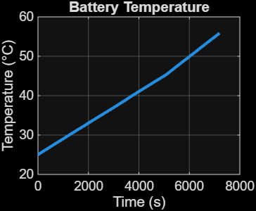

# Battery Management System (BMS) using MATLAB

## Overview

This project simulates an Electric Vehicle Battery Management System (BMS) developed using MATLAB and App Designer.

The system monitors battery performance during charging and discharging by estimating:

- State of Charge (SOC)
- Battery Voltage
- Battery Current
- Battery Temperature
- Battery Health (SOH)
- Charging and Discharging Status

The project also includes an interactive dashboard for real-time visualization.

---

## Features

- SOC Estimation
- Battery Voltage Monitoring
- Current Monitoring
- Temperature Monitoring
- Battery Health Estimation
- Charging / Discharging Detection
- Warning Generation
- Interactive MATLAB Dashboard

---

## Software Used

- MATLAB Online
- MATLAB App Designer

---

## Output Graphs

### State of Charge

---

### Battery Voltage

---

### Battery Current

---

### Battery Temperature

---

### Interactive Dashboard

---

## Project Files

- Battery_SOC_Project.m
- Battery_Management_System.mlapp
- SOC.png
- Voltage.png
- Current.png
- Temperature.png
- Interactive Dashboard.png

---

## Future Improvements

- Real-time sensor integration
- CAN Bus communication
- Cell balancing algorithm
- Battery fault detection
- Simulink implementation

---

Author
Subhankar Saha
